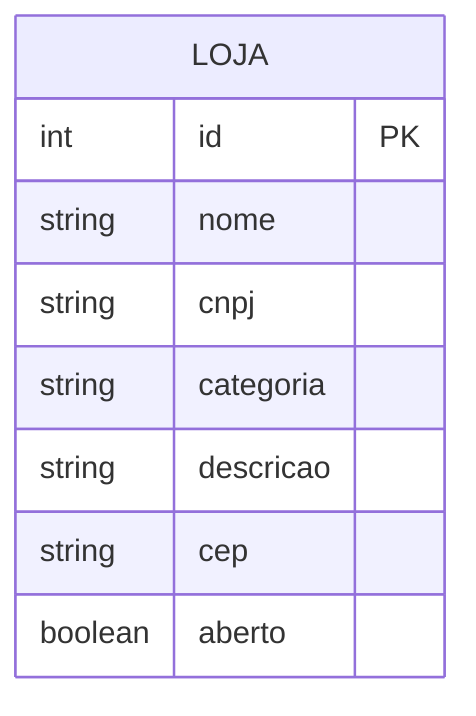

<h1 align="center">🥗 VittaRun</h1>

<p align="center">
  
</p>

<p align="center">
  <em>Plataforma de Delivery de Alimentos Saudáveis</em>
</p>

<p align="center">
  
  
  
  
  
  
</p>

---

## 📖 Sobre o Projeto

O **VittaRun** é uma aplicação backend para gerenciamento de lojas dentro de uma plataforma de delivery de alimentos saudáveis.

A proposta conecta usuários a estabelecimentos especializados em refeições equilibradas — como opções **fit, veganas e naturais** — trazendo praticidade sem abrir mão da saúde.

---

## 🧩 Problema & Solução

A maioria dos apps de delivery prioriza fast food, dificultando o acesso a opções saudáveis. O VittaRun resolve isso com uma plataforma **focada exclusivamente em alimentação saudável**.

| Problema | Solução |
|----------|---------|
| 🚫 Baixa oferta de opções saudáveis | ✅ Plataforma exclusiva para lojas saudáveis |
| 🚫 Falta de categorização eficiente | ✅ Organização por categorias (fit, vegano, natural) |
| 🚫 Difícil encontrar estabelecimentos especializados | ✅ Busca por nome e categoria |
| 🚫 Pouco equilíbrio entre praticidade e saúde | ✅ Delivery rápido com curadoria saudável |

---

## ✨ Funcionalidades

| Método | Descrição |
|--------|-----------|
| `findAll()` | Lista todas as lojas cadastradas |
| `findById()` | Retorna uma loja pelo seu ID |
| `findByNome()` | Busca lojas por nome ou categoria |
| `create()` | Cadastra uma nova loja |
| `update()` | Atualiza dados de uma loja existente |
| `delete()` | Remove uma loja do sistema |

---

## 🗂️ Entidade: Loja

```
Loja
├── id          → gerado automaticamente
├── nome        → nome da loja
├── cnpj        → CNPJ da loja (validado)
├── categoria   → fit | vegano | natural
├── descricao   → informações adicionais
├── cep         → código postal (validado)
└── aberto      → boolean (aberta/fechada)
```

---

## 🗃️ Diagrama ER



---

## 🔗 Endpoints da API

| Método | Rota | Descrição |
|--------|------|-----------|
| `POST` | `/lojas` | Cadastrar nova loja |
| `GET` | `/lojas` | Listar todas as lojas |
| `GET` | `/lojas/:id` | Buscar loja por ID |
| `GET` | `/lojas/nome/:nome` | Buscar loja por nome |
| `PUT` | `/lojas` | Atualizar loja |
| `DELETE` | `/lojas/:id` | Remover loja |

### Exemplo de payload

```json
{
  "nome": "Verde Vida",
  "cnpj": "12345678000199",
  "categoria": "vegano",
  "descricao": "Restaurante vegano com opções do dia",
  "cep": "01310100",
  "aberto": true
}
```

---

## 🛠️ Tecnologias Utilizadas

| Tecnologia | Finalidade |
|------------|-----------|
| **NestJS** | Framework backend |
| **TypeScript** | Linguagem de desenvolvimento |
| **MySQL** | Banco de dados relacional |
| **TypeORM** | Integração com o banco de dados |
| **class-validator** | Validação de dados dos DTOs |
| **Insomnia** | Testes das requisições HTTP |

---

## 🧪 Testes Realizados

Testes executados via **Insomnia**, cobrindo:

- ✅ Cadastro de lojas
- ✅ Listagem de todas as lojas
- ✅ Busca por ID e por nome
- ✅ Atualização de dados
- ✅ Exclusão de registros
- ✅ Simulação de erros (dados inválidos, registros inexistentes, categorias sem resultado)

---

## 🚀 Como Executar

### Pré-requisitos

- Node.js v20+
- MySQL v8+
- npm

### Instalação

```bash
# Clone o repositório
git clone https://github.com/seu-usuario/vittarun.git

# Acesse a pasta do projeto
cd vittarun

# Instale as dependências
npm install
```

### Rodando a aplicação

```bash
npm run start:dev
```

> A API estará disponível em `http://localhost:3000`

---

## 🔮 Próximas Implementações

- [ ] Autenticação de usuários com JWT
- [ ] Avaliações e comentários sobre as lojas
- [ ] Filtro avançado por tipo de alimentação
- [ ] Integração com sistemas de pagamento
- [ ] Rastreamento de pedidos em tempo real
- [ ] Recomendação personalizada de refeições
- [ ] Interface frontend

---

## 👥 Equipe

Projeto desenvolvido pela turma **JavaScript 14** da **Generation Brasil**:

| Nome |
|------|
| André Lucas - P.O |
| Andressa Andrade - Dev|
| Bruna Zuppini - Dev |
| Douglas Santos - Dev |
| Gabriel Coutinho - Dev |
| Kay Ira - Dev Tester|
| Lohanna Benjamim - Dev Tester|

> São Paulo – SP · 2026

---

## 📄 Licença

Este projeto está sob a licença **MIT**.
